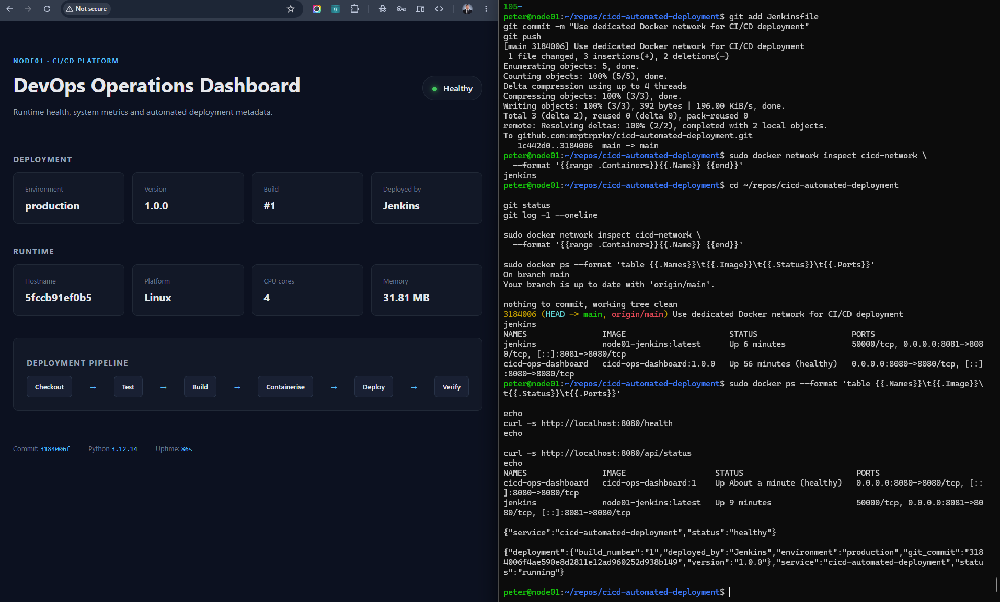
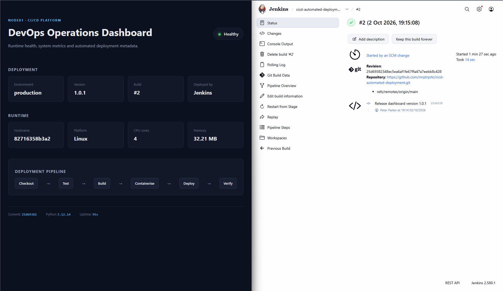
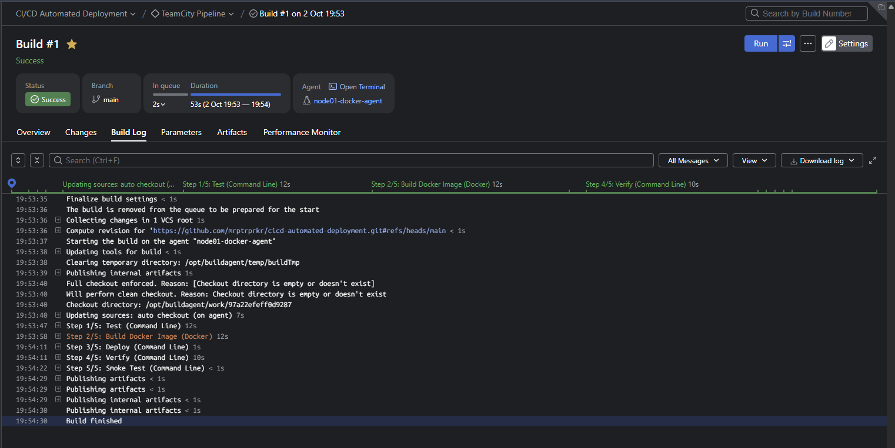

# CI/CD Automated Deployment

A hands-on CI/CD portfolio project demonstrating automated testing, containerisation, deployment, health verification and secure credential injection using **Jenkins, TeamCity, Docker, Python and GitHub**.

The project runs on my Linux homelab and demonstrates the complete workflow from a source-code change through to an automatically tested, containerised and verified deployment.

## Architecture

```text
                         GitHub
                           │
                           │ Source change
                           ▼
                    ┌─────────────┐
                    │   Jenkins   │
                    │    CI/CD    │
                    └──────┬──────┘
                           │
             ┌─────────────┼─────────────┐
             ▼             ▼             ▼
          Pytest       Docker Build   Credentials
             │             │             │
             └─────────────┼─────────────┘
                           ▼
                    Docker Deployment
                           │
                           ▼
                    Health Verification
                           │
                           ▼
                 Authenticated Smoke Test
                           │
                           ▼
                  Production Application
```

A second implementation of the pipeline was also built using **JetBrains TeamCity** to gain practical experience with an alternative enterprise CI/CD platform.

## CI/CD Pipeline

The Jenkins pipeline is defined as code in [`Jenkinsfile`](Jenkinsfile) and executes the following stages:

```text
Checkout
   ↓
Test
   ↓
Build
   ↓
Deploy
   ↓
Verify
   ↓
Smoke Test
```

### 1. Checkout

Retrieves the latest application source from GitHub.

### 2. Test

Creates an isolated Python virtual environment, installs the development dependencies and executes the automated test suite with `pytest`.

The tests validate application health, readiness, deployment metadata, system information and protected API access.

### 3. Build

Builds a versioned Docker image for the application.

```text
cicd-ops-dashboard:<build-number>
```

### 4. Deploy

Replaces the previous application container with the newly built version and injects deployment metadata at runtime.

Metadata includes:

- environment
- application version
- CI build number
- Git commit
- deployment platform

### 5. Verify

The pipeline polls Docker's health status and only continues when the new application container reports:

```text
healthy
```

A failed health check causes the deployment pipeline to fail.

### 6. Smoke Test

Post-deployment checks validate the running application rather than only confirming that the container started.

The pipeline checks:

```text
/health
/api/status
/api/secure
```

The protected endpoint requires a valid API credential, providing an additional test that CI-managed secret injection succeeded.

## Secure Credential Injection

Secrets are deliberately kept outside the Git repository.

The application expects the following runtime environment variable:

```text
DASHBOARD_API_TOKEN
```

For Jenkins, the value is stored as a **Secret Text credential** and retrieved by the pipeline using Jenkins Credentials Binding.

For TeamCity, the corresponding value is stored as a **Password parameter** and exposed to the build agent as an environment variable.

The secret itself is never hard-coded in:

- application source code
- `Jenkinsfile`
- Dockerfile
- Git history

The deployment pipeline injects the credential only at runtime and performs an authenticated request against `/api/secure`.

## Jenkins

Jenkins is the primary automated CI/CD platform for the project.

The Jenkins environment runs as a persistent container on the homelab server and has access to the Docker engine for application builds and deployments.

Repository changes are detected automatically through SCM polling, allowing the workflow:

```text
git push
   ↓
Jenkins detects change
   ↓
Automated tests
   ↓
Docker image build
   ↓
Application deployment
   ↓
Health verification
   ↓
Authenticated smoke test
```

### Automated Jenkins Deployment



### Jenkins SCM-Triggered Pipeline



## TeamCity

The same application was also configured with a five-stage **JetBrains TeamCity** pipeline:

```text
Test
Build Docker Image
Deploy
Verify
Smoke Test
```

A dedicated TeamCity build agent runs as a Docker container and communicates with the TeamCity server over a private Docker network.

The agent provides the build environment for Python, Git and Docker operations.

TeamCity's VCS trigger was tested successfully and subsequently disabled so that Jenkins remains the authoritative automatic deployment system. TeamCity can still execute the equivalent pipeline manually without creating competing deployments against the same production target.

### TeamCity Pipeline



## Application

The deployed application is a Flask-based DevOps operations dashboard exposing both a web interface and operational API endpoints.

Key endpoints include:

| Endpoint | Purpose |
| --- | --- |
| `/` | DevOps operations dashboard |
| `/health` | Container/application health check |
| `/ready` | Application readiness check |
| `/api/status` | Deployment metadata |
| `/api/system` | Runtime system information |
| `/api/secure` | Credential-protected pipeline verification |
| `/version` | Application version information |

The dashboard displays runtime information such as environment, application version, build number, Git commit, deployment platform, hostname, Python version, CPU and memory information.

## Technology Stack

| Area | Technology |
| --- | --- |
| Application | Python, Flask |
| Web server | Gunicorn |
| Testing | pytest |
| Containerisation | Docker |
| Primary CI/CD | Jenkins |
| Alternative CI/CD | JetBrains TeamCity |
| Source control | Git, GitHub |
| Operating system | Ubuntu Linux |
| Networking | Docker user-defined bridge network |
| Secrets | Jenkins Credentials, TeamCity Password Parameters |

## Docker Networking

Jenkins, TeamCity and the deployed application use a dedicated Docker network:

```text
cicd-network
```

This allows CI services to communicate with application containers using Docker DNS rather than depending on host IP addresses.

For example:

```text
http://cicd-ops-dashboard:8080/health
```

can be used by CI workers for post-deployment verification.

## Deployment Metadata

Each deployment receives metadata from the CI/CD system at runtime.

Example:

```json
{
  "build_number": "4",
  "deployed_by": "Jenkins",
  "environment": "production",
  "git_commit": "<commit-sha>",
  "version": "1.0.1"
}
```

This makes it possible to identify exactly which application version, CI build and source revision is currently running.

## Engineering Decisions

### Jenkins as the authoritative deployer

Both Jenkins and TeamCity were implemented against the same application. Allowing both systems to automatically replace the same production container could create deployment races.

Jenkins therefore remains responsible for automatic deployment, while the TeamCity VCS trigger is disabled after successful validation and the TeamCity pipeline remains available for manual comparison and testing.

### Health checks before smoke tests

A running Docker container does not necessarily mean the application is ready.

The pipeline waits for Docker's application health check to report `healthy` before performing API-level smoke tests.

### Runtime configuration

Deployment-specific information and credentials are supplied through environment variables rather than baked into the Docker image.

This allows the same application image to be configured by the deployment environment.

## Homelab vs Production

This project intentionally runs on a single-node homelab environment for practical learning.

In a production environment I would additionally consider:

- isolated and least-privilege CI build agents
- external secret-management services
- TLS termination and restricted CI administration interfaces
- an external production-grade TeamCity database
- image registry integration
- immutable/versioned releases
- staging and production environments
- deployment approvals
- automated rollback
- blue/green or rolling deployment strategies
- centralised monitoring and logging

Docker socket access is appropriate for this controlled homelab exercise but grants significant host privileges; production CI workers should use a more isolated build architecture.

## What This Project Demonstrates

This project provides practical experience with:

- CI/CD pipeline design
- pipeline-as-code
- automated software testing
- Docker image builds
- automated container deployment
- deployment health checks
- post-deployment smoke testing
- CI/CD secret management
- Git-based automation
- Jenkins administration
- TeamCity server and build-agent configuration
- Docker networking
- deployment metadata and traceability
- Linux-based CI/CD infrastructure

---

Built as part of my practical **Cloud / DevOps / Infrastructure Engineering** portfolio.
